# Execution Plan — Fintech Microservices Platform

## Detailed Analysis Summary

### Change Impact Assessment
- **User-facing changes**: Yes — Retail banking platform với account management, fund transfer, transaction history
- **Structural changes**: Yes — Greenfield microservices architecture với 3 bounded contexts
- **Data model changes**: Yes — DDD aggregates, entities, value objects cho Fintech domain
- **API changes**: Yes — REST APIs cho mỗi bounded context + Kafka events
- **NFR impact**: Yes — Security (Fintech), performance, observability, containerization

### Risk Assessment
- **Risk Level**: Medium-High (Fintech domain, financial transactions, data consistency)
- **Rollback Complexity**: Easy (Greenfield — no existing system to break)
- **Testing Complexity**: Complex (DDD, event-driven, financial business rules, PBT)

---

## Workflow Visualization

```mermaid
flowchart TD
    Start(["User Request"])
    
    subgraph INCEPTION["🔵 INCEPTION PHASE"]
        WD["Workspace Detection<br/><b>COMPLETED</b>"]
        RA["Requirements Analysis<br/><b>COMPLETED</b>"]
        US["User Stories<br/><b>COMPLETED</b>"]
        WP["Workflow Planning<br/><b>COMPLETED</b>"]
        AD["Application Design<br/><b>EXECUTE</b>"]
        UG["Units Generation<br/><b>EXECUTE</b>"]
    end
    
    subgraph CONSTRUCTION["🟢 CONSTRUCTION PHASE"]
        FD["Functional Design<br/><b>EXECUTE</b><br/>(per-unit)"]
        NFRA["NFR Requirements<br/><b>EXECUTE</b><br/>(per-unit)"]
        NFRD["NFR Design<br/><b>EXECUTE</b><br/>(per-unit)"]
        ID["Infrastructure Design<br/><b>EXECUTE</b><br/>(per-unit)"]
        CG["Code Generation<br/><b>EXECUTE</b><br/>(per-unit)"]
        BT["Build and Test<br/><b>EXECUTE</b>"]
    end
    
    Start --> WD
    WD --> RA
    RA --> US
    US --> WP
    WP --> AD
    AD --> UG
    UG --> FD
    FD --> NFRA
    NFRA --> NFRD
    NFRD --> ID
    ID --> CG
    CG -.->|Next Unit| FD
    CG --> BT
    BT --> End(["Complete"])
    
    style WD fill:#4CAF50,stroke:#1B5E20,stroke-width:3px,color:#fff
    style RA fill:#4CAF50,stroke:#1B5E20,stroke-width:3px,color:#fff
    style US fill:#4CAF50,stroke:#1B5E20,stroke-width:3px,color:#fff
    style WP fill:#4CAF50,stroke:#1B5E20,stroke-width:3px,color:#fff
    style AD fill:#FFA726,stroke:#E65100,stroke-width:3px,stroke-dasharray: 5 5,color:#000
    style UG fill:#FFA726,stroke:#E65100,stroke-width:3px,stroke-dasharray: 5 5,color:#000
    style FD fill:#FFA726,stroke:#E65100,stroke-width:3px,stroke-dasharray: 5 5,color:#000
    style NFRA fill:#FFA726,stroke:#E65100,stroke-width:3px,stroke-dasharray: 5 5,color:#000
    style NFRD fill:#FFA726,stroke:#E65100,stroke-width:3px,stroke-dasharray: 5 5,color:#000
    style ID fill:#FFA726,stroke:#E65100,stroke-width:3px,stroke-dasharray: 5 5,color:#000
    style CG fill:#4CAF50,stroke:#1B5E20,stroke-width:3px,color:#fff
    style BT fill:#4CAF50,stroke:#1B5E20,stroke-width:3px,color:#fff
    style INCEPTION fill:#BBDEFB,stroke:#1565C0,stroke-width:3px,color:#000
    style CONSTRUCTION fill:#C8E6C9,stroke:#2E7D32,stroke-width:3px,color:#000
    style Start fill:#CE93D8,stroke:#6A1B9A,stroke-width:3px,color:#000
    style End fill:#CE93D8,stroke:#6A1B9A,stroke-width:3px,color:#000
    linkStyle default stroke:#333,stroke-width:2px
```



### Text Alternative
```
Phase 1: INCEPTION
  - Workspace Detection (COMPLETED)
  - Requirements Analysis (COMPLETED)
  - User Stories (COMPLETED)
  - Workflow Planning (COMPLETED)
  - Application Design (EXECUTE)
  - Units Generation (EXECUTE)

Phase 2: CONSTRUCTION (per-unit loop)
  - Functional Design (EXECUTE, per-unit)
  - NFR Requirements (EXECUTE, per-unit)
  - NFR Design (EXECUTE, per-unit)
  - Infrastructure Design (EXECUTE, per-unit)
  - Code Generation (EXECUTE, per-unit)
  - Build and Test (EXECUTE, after all units)
```

---

## Phases to Execute

### 🔵 INCEPTION PHASE
- [x] Workspace Detection (COMPLETED)
- [x] Requirements Analysis (COMPLETED)
- [x] User Stories (COMPLETED)
- [x] Workflow Planning (COMPLETED)
- [ ] Application Design - EXECUTE
  - **Rationale**: Cần xác định 3 bounded contexts thành microservices, định nghĩa component methods, service layer, và dependencies giữa các services
- [ ] Units Generation - EXECUTE
  - **Rationale**: 2-3 microservices cần decomposition thành units of work với dependency ordering

### 🟢 CONSTRUCTION PHASE (per-unit, step-by-step with user review)

**Nguyên tắc**: Mỗi stage trình bày cho user review và approve trước khi chuyển tiếp. Code Generation chia 2 phần: Planning (review trước) → Generation (implement sau approve). Không implement code mà không có approval.

- [ ] Functional Design - EXECUTE (per-unit) → [USER REVIEW]
  - **Rationale**: Complex DDD business logic — financial transactions, aggregates, domain events, saga patterns
- [ ] NFR Requirements - EXECUTE (per-unit) → [USER REVIEW]
  - **Rationale**: Security Baseline (15 rules), PBT framework selection (jqwik), performance requirements cho Fintech
- [ ] NFR Design - EXECUTE (per-unit) → [USER REVIEW]
  - **Rationale**: NFR patterns cần incorporate — circuit breaker, retry, rate limiting, structured logging
- [ ] Infrastructure Design - EXECUTE (per-unit) → [USER REVIEW]
  - **Rationale**: Docker Compose orchestration, Kafka, PostgreSQL per service, Eureka, Gateway mapping
- [ ] Code Generation Plan - EXECUTE (per-unit) → [USER REVIEW trước khi implement]
  - **Rationale**: Trình bày plan chi tiết để user review trước khi generate code
- [ ] Code Generation - EXECUTE (per-unit) → [USER REVIEW]
  - **Rationale**: Implementation theo approved plan
- [ ] Build and Test - EXECUTE (ALWAYS) → [USER REVIEW]
  - **Rationale**: Build instructions, unit tests, integration tests, PBT tests

### 🟡 OPERATIONS PHASE
- [ ] Operations - PLACEHOLDER

### Skipped Stages
- Reverse Engineering - SKIP (Greenfield project)

---

## Success Criteria
- **Primary Goal**: Fintech microservices platform với DDD + Hexagonal Architecture hoạt động end-to-end
- **Key Deliverables**:
  - 2-3 microservices (Account, Transfer, Transaction History)
  - Spring Cloud Gateway + Eureka
  - Kafka event-driven communication
  - Docker Compose cho full stack
  - Comprehensive tests (unit + integration + PBT)
- **Quality Gates**:
  - Security Baseline compliance (15 SECURITY rules)
  - PBT compliance (10 PBT rules)
  - All acceptance criteria from user stories testable
  - DDD patterns correctly applied
